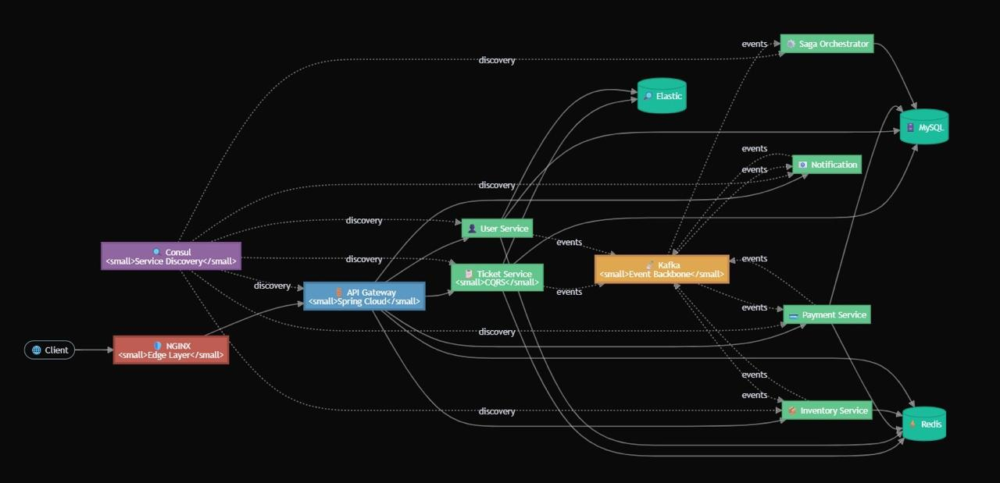

# Event-Driven Ticketing Platform

Microservices-based ticketing system (Java 21, Spring Boot 3) for ticket booking, payment, and notifications. The architecture follows an event-driven microservices pattern with the following key components:

### Architecture

---

## Key Components

- **Client Layer:** External clients (web, mobile) accessing the system via API Gateway
- **API Gateway:** Spring Cloud Gateway routing requests to appropriate services; single entry point with path-based routing, CORS, and unified error responses
- **Microservices:** Independent services: User, Ticket, Payment, Inventory, Notification: each with bounded context and own database
- **Common Event Library:** Shared JAR for typed domain events and Kafka publisher; used by all services for consistent event contracts
- **Kafka Event Backbone:** Apache Kafka as central message broker for asynchronous event-driven communication between services
- **Service Discovery:** Consul for service registration and discovery; gateway routes using load-balanced service names
- **Data Stores:** MySQL per service for persistent storage; Redis for caching and distributed locking (Redisson); Elasticsearch for search
- **Authentication:** Keycloak as identity provider (OAuth2/OIDC); JWT validation at API Gateway and resource servers; role-based access control (RBAC)
- **Payment Gateway:** VNPAY integration in Payment Service for real payment flow; callback endpoint for return URL and status sync

---

## Features

- **Microservices Architecture:** Independent, scalable services with clear domain boundaries and database-per-service
- **Event-Driven Communication:** Asynchronous messaging via Apache Kafka; typed events (ticket-created, payment-completed, user-created, etc.) with multiple consumers per topic
- **CQRS Implementation:** Command Query Responsibility Segregation in Ticket Service for optimized read/write operations (command and query handlers)
- **Service Discovery:** Consul-based service registration and discovery; health checks and load-balanced routing
- **API Gateway:** Single entry point with routing, load balancing, CORS, and unified error responses
- **Resilience Patterns:** Circuit breakers and retries (Resilience4j) for Ticket → Inventory calls; distributed locking (Redisson) for seat reserve/release to prevent overbooking
- **Caching:** Redis-based cache-aside for User, Inventory, and Ticket with TTL and eviction on write
- **Optimistic Locking:** Versioned Ticket entity to handle concurrent updates safely
- **VNPAY Integration:** Real payment flow via VNPAY gateway; configurable TmnCode, HashSecret, return URL; callback handler to update payment status and publish events
- **Keycloak Authentication:** OAuth2/OIDC with JWT; Spring Security resource server; realm and client configuration; RBAC with Keycloak roles; optional user sync
- **Monitoring & Observability:** Spring Actuator health endpoints; Micrometer and Prometheus for metrics
- **Search & Analytics:** Elasticsearch integration for user search by keyword and ticket indexing
- **Health Checks:** Comprehensive health endpoints for all services
- **API Documentation:** OpenAPI/Swagger documentation for all services
- **Containerization:** Docker and Docker Compose for infrastructure (MySQL, Redis, Kafka, Zookeeper, Consul, Elasticsearch, Keycloak) and local runs

---

## Tech Stack

- **Core**: Java 21, Spring Boot 3.2, Spring Cloud 2023.0, Maven (multi-module)
- **API & Gateway**: Spring Web (REST), Spring Cloud Gateway (reactive)
- **Messaging**: Apache Kafka 7.5, Spring Kafka
- **Data**: MySQL 8, Spring Data JPA, Redis 7, Redisson, Elasticsearch 8.x
- **Discovery**: HashiCorp Consul
- **Resilience**: Resilience4j (circuit breaker, retry)
- **Docs & Observability**: SpringDoc OpenAPI, Actuator, Micrometer/Prometheus
- **Infrastructure**: Docker, Docker Compose

